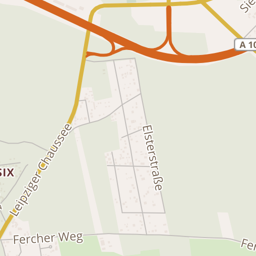

# Trustroots Hitchmap styles

To be used at [Trustroots](https://www.trustroots.org/) and perhaps later at [Hitchwiki](http://hitchwiki.org).

- Clearly visible highways and main ways
- Gas stations, rest areas and bus stops marked clearly

For [Mapbox Studio](https://www.mapbox.com/mapbox-studio/) using [Mapbox Streets](https://www.mapbox.com/) vector tiles.

Contact [Mikael](http://www.mikaelkorpela.fi) if you want to contribute.
